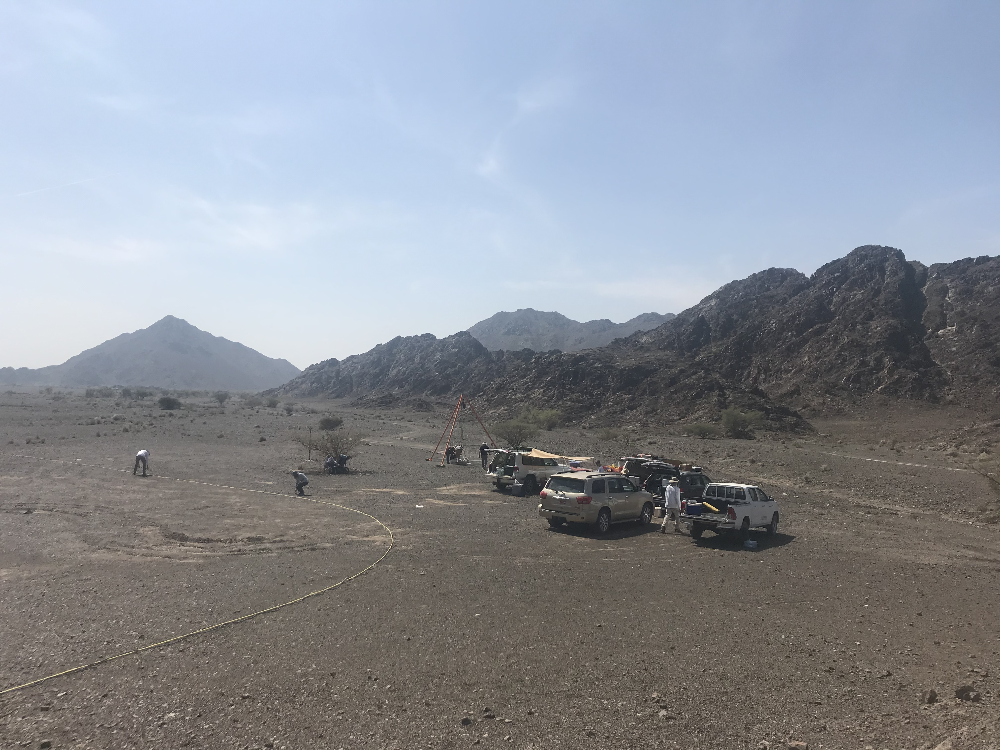

# Hello world!

### I'm Tristan. I study microorganisms that live in the Earth's subsurface.

-   [Google Scholar](https://scholar.google.com/citations?user=lwYzFS4AAAAJ&hl=en)

-   [GitHub](github.com/tacaro)

-   [Twitter](https://twitter.com/tris_caro)

-   Email: tristan.caro at colorado.edu

